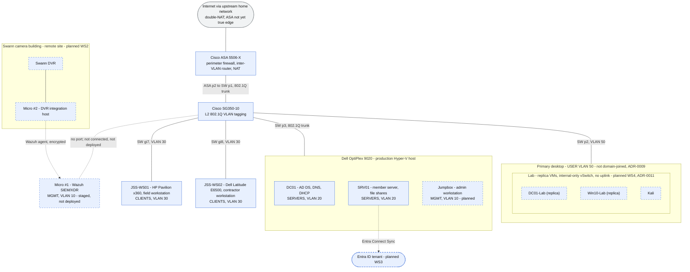

# Network Topology

**Last updated:** 2026-07-18

Companion to [`trust-acl-flow.md`](trust-acl-flow.md) (network policy) and [`ou-structure-gpo-summary.md`](ou-structure-gpo-summary.md) (identity). This diagram shows what is physically *connected*: devices, ports, and trunks. Port assignments were reconciled against the SG350 MAC table on 2026-07-18 (WS1 verification runbook, step 1.7): gi1 = ASA trunk, gi2 = primary desktop, gi3 = Hyper-V host (all matching the 2026-05-06 cabling journal), gi7 = JSS-WS01, gi8 = JSS-WS02 (new records; the two laptops distinguished by MAC OUI, Dell on gi8 matching the E6500).

**Legend.** Blue box = built and documented. Blue dashed box = planned or staged, not deployed. Gray box = external. Solid line = documented physical link; dotted line = planned link or undocumented port. Port labels appear only where cabling is recorded.

## Elements

| Element | Role | Network | Status | Source |
|---|---|---|---|---|
| Cisco ASA 5506-X | Perimeter firewall, inter-VLAN router, NAT | All VLANs (router-on-a-stick) | Built | 2026-05-06 journal |
| Cisco SG350-10 | L2 802.1Q tagging only | Trunk to ASA (p1) | Built | 2026-05-06 journal |
| Dell OptiPlex 9020 | Production Hyper-V host | SW p3, 802.1Q trunk | Built | 2026-05-29, 2026-06-03 journals |
| DC01 (VM) | AD DS, DNS, DHCP | SERVERS, 10.10.20.10 | Built; renamed to DC01 2026-06-11 | 2026-06-08/11 journals |
| SRV01 (VM) | Member server, file shares | SERVERS, 10.10.20.20 | Built | 2026-06-04 journal |
| Jumpbox (VM) | Admin workstation for tiered admin | MGMT | Planned | outline WS1 |
| Primary desktop (i7-12700K) | Development workstation; future lab host; never domain-joined | USER, SW p2 | Built | ADR-0009 |
| Lab (replica VMs + Kali) | Detection and attack validation | Internal-only vSwitch, no uplink | Planned WS4; generic replica | ADR-0011 |
| Micro #1 | Bare-metal Wazuh SIEM/XDR | MGMT; no switch port (absent from MAC table 2026-07-18) | Staged, not deployed (needs RAM/SSD) | ADR-0012; 2026-07-18 runbook 1.7 |
| JSS-WS01 (HP Pavilion x360) | Field workstation | CLIENTS; SW gi7 | Built, domain-joined | 2026-06-12 journal; port 2026-07-18 runbook 1.7 (OUI-distinguished) |
| JSS-WS02 (Dell Latitude E6500) | Contractor workstation | CLIENTS; SW gi8 | Built, domain-joined | 2026-06-12 journal; port 2026-07-18 runbook 1.7 (Dell OUI) |
| Swann DVR + Micro #2 | Surveillance and DVR integration host | Remote building, own internet | Planned WS2 | ADR-0012 |
| Entra ID tenant | Hybrid identity | Cloud | Planned WS3 | outline WS3 |

## VLANs

| VLAN | ID | Subnet | Purpose |
|---|---|---|---|
| MGMT | 10 | 10.10.10.0/24 | Infrastructure management |
| SERVERS | 20 | 10.10.20.0/24 | Domain controller, member server |
| CLIENTS | 30 | 10.10.30.0/24 | Business workstations |
| USER | 50 | 10.10.50.0/24 | Development workstation |

## Notes

- The ASA performs all inter-VLAN routing and ACL enforcement via 802.1Q subinterfaces on the trunk to the SG350 (router-on-a-stick). The switch does L2 tagging only.
- The network currently double-NATs through the upstream home network, so the ASA is not yet the true edge. This must be resolved before Workstream 3 remote access work (2026-05-06 journal).
- The USER VLAN is running a temporarily permissive ACL during buildout, to be re-restricted at the end of Workstream 1 (ADR-0008); the policy detail lives in the trust and ACL flow companion.
- The lab is a generic replica built from this repo's documentation (own domain name, fresh SIDs), not a clone of production (ADR-0011).
- Switch port assignments were confirmed 2026-07-18 via `show mac address-table` (runbook step 1.7): gi7 = JSS-WS01, gi8 = JSS-WS02, Micro #1 not connected. The gi7/gi8 split between the laptops rests on MAC OUI (Dell 00:21:70 on gi8 matches the E6500); a `getmac` on JSS-WS01 would upgrade it from inference to direct evidence.
- Switch findings from the same session (2026-07-18 journal): the SG350 still runs its factory hostname, its management interface sits on default VLAN 1 rather than MGMT, and its clock has never been set (log timestamps read 2019) with no SNTP configured. Recorded, not fixed; remediation belongs to the new era.
- **Source of truth** is the physical cabling and device configurations; this diagram explains intent and recorded state.
