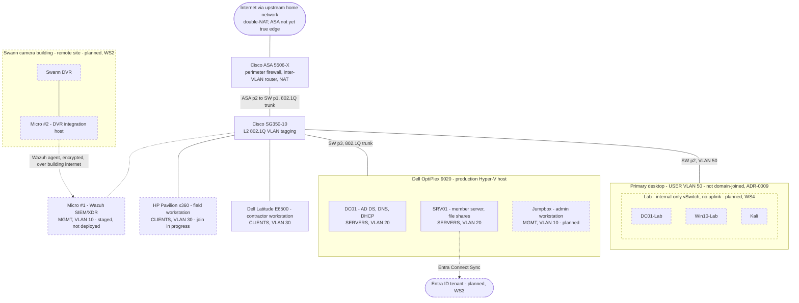

# Network Topology

**Last updated:** 2026-06-11

Solid outlines and lines are built; dashed are planned or in flight. Port labels appear only where the physical cabling is documented (2026-05-06 journal): ASA p2 → SW p1 (802.1Q trunk), SW p2 → primary desktop (VLAN 50), SW p3 → Hyper-V host (802.1Q trunk).

## VLANs

| VLAN | ID | Subnet | Purpose |
|---|---|---|---|
| MGMT | 10 | 10.10.10.0/24 | Infrastructure management; monitoring host (planned) |
| SERVERS | 20 | 10.10.20.0/24 | Domain controller, member server; document and video management (planned) |
| CLIENTS | 30 | 10.10.30.0/24 | Business workstations |
| USER | 50 | 10.10.50.0/24 | Development workstation |

## Notes

- The ASA performs all inter-VLAN routing and ACL enforcement via 802.1Q subinterfaces on the trunk to the SG350 (router-on-a-stick). The switch does L2 tagging only.
- The network currently double-NATs through the upstream home network, so the ASA is not yet the true edge. This must be resolved before Workstream 3 remote access work (2026-05-06 journal).
- The USER VLAN is running a temporarily permissive ACL during buildout, to be re-restricted at the end of Workstream 1 (ADR-0008).
