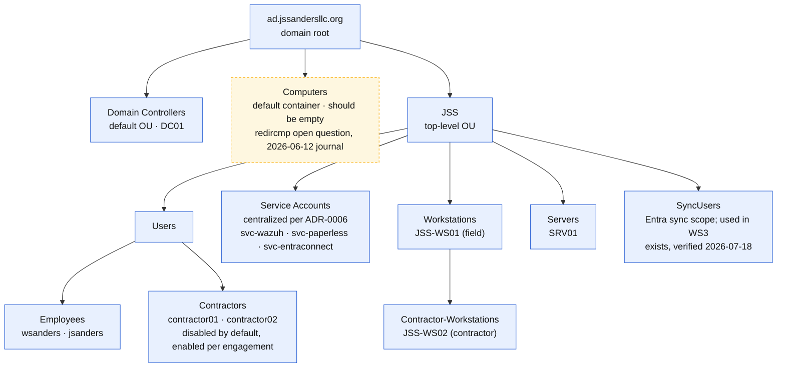

# OU Structure & GPO Summary

**Last updated:** 2026-07-18

Companion to [`network-topology.md`](network-topology.md) (physical) and [`trust-acl-flow.md`](trust-acl-flow.md) (network policy). This diagram shows the identity layer: how AD organizes objects and where policy attaches. Structure per ADR-0004; flat groups per ADR-0005; service account centralization per ADR-0006. Reconciled against AD on 2026-07-18 (WS1 verification runbook, Phase 3); the one remaining amber item (the Computers container) is an open design question, not an unverified fact.

**Legend.** Blue box = documented and believed current. Amber dashed box = existence, placement, or membership not recorded in journals; confirm on-site. Role and policy attach to OUs and groups, never to hostnames (ADR-0010).

## GPO Summary

All five GPOs in the domain were inventoried 2026-07-18 (`Get-GPO -All` plus GPOReport link extraction); no others exist.

| GPO | Link target | Status | Source |
|---|---|---|---|
| GPO-Domain-PasswordPolicy | Domain root, enabled | Built, **but shadowed (finding F4)**: Default Domain Policy outranks it, so effective domain policy is the stock defaults (min length 7, max age 42d, no lockout) | verified 2026-07-18 |
| Default Domain Policy | Domain root, enabled | Built; carries the effective account policy per F4 | verified 2026-07-18 |
| GPO-Domain-AuditPolicy | Domain root, enabled | Built; advanced audit (credential validation, Kerberos, account and group management, logon, file share and file system S+F, policy change, sensitive privilege use) | verified 2026-07-18 |
| Default Domain Controllers Policy | Domain Controllers OU, enabled | Built (default) | verified 2026-07-18 |
| GPO-ServiceAccounts-DenyLogon | JSS > Service Accounts OU, enabled | Built; denies interactive and RDP logon to the three service accounts | verified 2026-07-18 |
| Contractor account lifecycle | previously assumed at Contractors OU | **Does not exist (finding F8)**: no such GPO is in the domain; the lifecycle (accounts rest disabled) is procedural, and the 2026-05-07 journal's control was never a GPO | verified absent 2026-07-18 |
| Contractor workstation restrictions | JSS > Workstations > Contractor-Workstations | Never built; retired per ADR-0014, design case remains in ADR-0007 | 2026-06-12 journal |
| Tiered admin deny-logon set | Workstations, Servers, Jumpbox | Never built; carried to the new era per ADR-0014 | outline WS1 |

## Security Groups (flat by design, ADR-0005)

| Group | Members | Grants | Classification tier served |
|---|---|---|---|
| SG-Documents-FullControl | wsanders | Full control on document shares | Confidential and below |
| SG-Documents-Read | jsanders | Read on document shares | Internal |
| SG-Surveillance-FullControl | wsanders | Full control on surveillance data | Restricted |
| SG-Surveillance-Read | jsanders | Read on surveillance data | Restricted (read) |
| SG-Contractor-Projects | contractor01, contractor02 | **Nothing (finding F5)**: `icacls /findsid` found no NTFS grant anywhere; the scoped project access was design intent never implemented | intended scoped Internal; effective access is Public only |

Phase 4 executed 2026-07-18: contractor01 verified Public allowed, Internal, Confidential, and Restricted denied, so the classification tiers hold for a low-privilege account. Membership verified via `Get-ADGroupMember`. F5 above is the gap between intent and implementation for the contractor grant.

## Notes

- **No simulated objects.** Production AD contains only the real business (ADR-0004). All manufactured complexity belongs to the replica lab.
- **The Computers container should stay empty.** The workstation SOP moves every joined machine to its OU; the open question from 2026-06-12 is whether `redircmp` should make JSS > Workstations the default landing spot and remove the manual step.
- **Contractor accounts rest disabled.** The safe state is the resting state; enabling is a deliberate per-engagement act (2026-05-07 journal).
- **Verification complete (2026-07-18).** SRV01 sits in JSS > Servers, Service Accounts holds svc-wazuh, svc-paperless, and svc-entraconnect, SyncUsers exists, and the GPO inventory above is exhaustive. Two findings came out of this layer: F4 (password policy shadowed) and F8 (the assumed contractor-lifecycle GPO does not exist). Evidence: the 2026-07-18 journal.
- **Source of truth** is Active Directory itself (ADUC, `Get-ADOrganizationalUnit`, `Get-GPO`); this diagram explains intent and recorded state.
