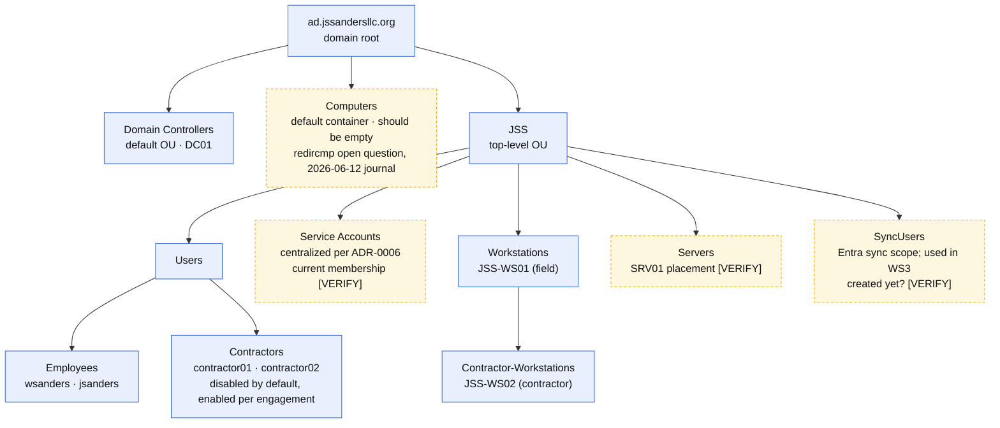

# OU Structure & GPO Summary

**Last updated:** 2026-07-01

Companion to [`network-topology.md`](network-topology.md) (physical) and [`trust-acl-flow.md`](trust-acl-flow.md) (network policy). This diagram shows the identity layer: how AD organizes objects and where policy attaches. Structure per ADR-0004; flat groups per ADR-0005; service account centralization per ADR-0006. Anything marked **[VERIFY]** is unrecorded in the journals and resolves during the [WS1 verification runbook](../../SOPs/ws1-verification-runbook.md) (Phase 3).

**Legend.** Blue box = documented and believed current. Amber dashed box = existence, placement, or membership not recorded in journals; confirm on-site. Role and policy attach to OUs and groups, never to hostnames (ADR-0010).

## GPO Summary

| GPO | Link target | Status | Source |
|---|---|---|---|
| Password policy | Domain level (assumed) **[VERIFY name and link]** | Built | 2026-05-10 journal |
| Audit logging | Domain level (assumed) **[VERIFY name and link]** | Built | 2026-05-10 journal |
| Contractor account lifecycle | Contractors OU (assumed) **[VERIFY name and link]** | Built | 2026-05-07 journal |
| Contractor workstation restrictions | JSS > Workstations > Contractor-Workstations | **Planned**; OU exists, GPO not built | 2026-06-12 journal |
| Tiered admin deny-logon set | Workstations, Servers, Jumpbox | **Planned**; lands with the tiered admin implementation | outline WS1 |

## Security Groups (flat by design, ADR-0005)

| Group | Members | Grants | Classification tier served |
|---|---|---|---|
| SG-Documents-FullControl | wsanders | Full control on document shares | Confidential and below |
| SG-Documents-Read | jsanders | Read on document shares | Internal |
| SG-Surveillance-FullControl | wsanders | Full control on surveillance data | Restricted |
| SG-Surveillance-Read | jsanders | Read on surveillance data | Restricted (read) |
| SG-Contractor-Projects | contractor01, contractor02 | Scoped project share only | Scoped Internal; excluded from Confidential/Restricted |

Tier mapping is design intent per the data classification model; Phase 4 of the verification runbook tests whether the NTFS reality matches.

## Notes

- **No simulated objects.** Production AD contains only the real business (ADR-0004). All manufactured complexity belongs to the replica lab.
- **The Computers container should stay empty.** The workstation SOP moves every joined machine to its OU; the open question from 2026-06-12 is whether `redircmp` should make JSS > Workstations the default landing spot and remove the manual step.
- **Contractor accounts rest disabled.** The safe state is the resting state; enabling is a deliberate per-engagement act (2026-05-07 journal).
- **[VERIFY] items feed the runbook.** SRV01's OU placement, Service Accounts membership, SyncUsers existence, and the built GPO names/links all resolve in one `Get-ADOrganizationalUnit`/`Get-GPO -All`/`gpresult` pass during the WS1 verification session.
- **Source of truth** is Active Directory itself (ADUC, `Get-ADOrganizationalUnit`, `Get-GPO`); this diagram explains intent and recorded state.
