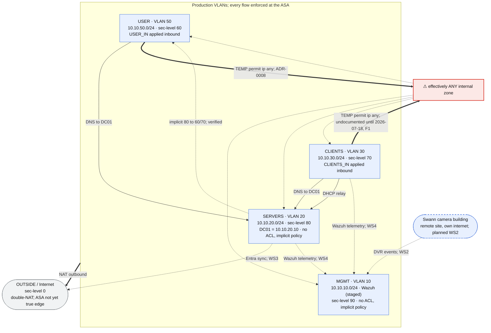

# Trust & ACL Flow (Logical Policy View)

**Last updated:** 2026-07-18

Companion to [`network-topology.md`](network-topology.md). That diagram shows what is *connected* (devices, ports, trunks). This one shows what is *permitted* and where it is enforced: the logical trust boundaries between segments, current state plus the planned flows that will cross them.

This document has three layers with distinct jobs: the **graph** is the narrative overview, the **reachability matrix** is the authoritative statement of current policy state (every zone pair accounted for, including the unknowns), and the **flows table** is the evidence layer recording the basis for each entry.

All inter-VLAN traffic is enforced at one point: the **Cisco ASA 5506-X**, router-on-a-stick over the 802.1Q trunk to the SG350 (the switch does L2 tagging only). The steady-state target is **default-deny between segments with explicit least-privilege permits** (ADR-0003). Two temporary broad permits are in effect: the documented USER one (ADR-0008) and a CLIENTS mirror discovered during verification (finding F1, 2026-07-18 journal). This diagram was reconciled against the running config on 2026-07-18 via the [WS1 verification runbook](../../SOPs/ws1-verification-runbook.md), Phases 1 and 2; no unverified policy edges remain.

Edge labels are deliberately terse; the Flows table below carries the full rule text, basis, and status for every edge.

**Legend.** Blue box = zone with known parameters. Amber dashed box = zone whose security level / ACL state is unverified. Red box = effective over-reach (documented technical debt). Gray box = external. Blue dashed box = planned, not built. Solid arrow = explicit documented permit or built behavior; thick arrow = temporary permit (debt) or NAT; dotted arrow = implicit/by-default, unverified, or planned flow (planned edges are labeled as such).

## Reachability Matrix (Current State)

Source zone (rows) to destination zone (columns), as enforced at the ASA today. Unlike the graph, every pair must declare itself; an unknown here is a visible gap, not a missing arrow. Planned flows are deliberately absent; the matrix records state, not commitments.

| Source ↓ Dest → | USER | CLIENTS | SERVERS | MGMT | OUTSIDE |
|---|---|---|---|---|---|
| **USER** (60, `USER_IN`) | n/a | Permit; **temp** (ADR-0008) | Permit; **temp** (DNS permit permanent) | Permit; **temp** (ADR-0008) | Permit; NAT outbound |
| **CLIENTS** (70, `CLIENTS_IN`) | Permit; **temp, undocumented** (F1) | n/a | Permit; **temp** (DNS permit permanent) | Permit; **temp, undocumented** (F1) | Permit; NAT outbound |
| **SERVERS** (80, no ACL) | Implicit permit, 80 to 60; verified | Implicit permit, 80 to 70; verified | n/a | **Deny**; implicit, 80 below 90 | Permit; NAT outbound |
| **MGMT** (90, no ACL) | Implicit permit, 90 to 60; verified | Implicit permit, 90 to 70; verified | Implicit permit, 90 to 80; verified | n/a | Permit; NAT outbound |
| **OUTSIDE** (0) | No path | No path | No path | No path | n/a |

All cells verified against the running config 2026-07-18 (`show nameif`, `show running-config access-list`, `show running-config access-group`, `show running-config nat`).

Reading notes:

- **n/a** = intra-zone traffic never crosses the ASA (switch does L2 only), so no policy applies here.
- **The USER and CLIENTS rows are the buildout permissiveness made visible.** USER's broad permit is documented debt (ADR-0008); CLIENTS's is finding F1, undocumented until 2026-07-18. Both retire together in the new era's ACL rebuild (ADR-0008 amendment, ADR-0014).
- **The OUTSIDE row** relies on the double-NAT upstream and the absence of static NAT entries; verified 2026-07-18, no statics exist (Phase 1.6).
- **Verification outcome, 2026-07-18:** every previously Unknown cell resolved. One survived as a finding rather than a documented permit: the CLIENTS broad permit (F1), now recorded above and in `asa-acl-ruleset.md`.

## Flows shown

| Flow | Basis | Type | Status |
|---|---|---|---|
| USER → SERVERS (DC01:53) | `USER_IN` permit udp/tcp 53 to 10.10.20.10 | Explicit permit | Permanent |
| USER → ANY internal | `USER_IN` permit ip 10.10.50.0/24 any | Explicit permit | **Temporary**: ADR-0008; retires in the new-era ACL rebuild |
| CLIENTS → ANY internal | `CLIENTS_IN` permit ip 10.10.30.0/24 any | Explicit permit | **Temporary, undocumented until found 2026-07-18 (F1)**; retires with the USER permit |
| CLIENTS → SERVERS (DC01: DNS) | `CLIENTS_IN` permit udp/tcp 53 to 10.10.20.10 | Explicit permit | Permanent; verified 2026-07-18 |
| CLIENTS → SERVERS (AD services) | Mechanism resolved 2026-07-18: `CLIENTS_IN`'s broad permit carries Kerberos/LDAP/SMB/GPO traffic (security levels alone, 70 to 80, would deny) | Explicit permit via F1 rule | Verified; survives only until the broad permit retires, after which scoped permits are required |
| CLIENTS → DC01 (DHCP) | ASA `dhcprelay` forwards CLIENTS broadcasts to 10.10.20.10; relay also enabled on USER (previously unrecorded) | To-the-box relay, not an ACL flow | Verified 2026-07-18 |
| SERVERS → USER / CLIENTS | Implicit security-level (80 → 60, 80 → 70); no SERVERS ACL exists | Default-permit | Verified 2026-07-18 |
| MGMT → all lower zones | Implicit security-level (90 → 80/70/60); no MGMT ACL exists | Default-permit | Verified 2026-07-18 |
| All VLANs → Internet | NAT (no inbound; double-NAT); four dynamic PATs, no statics | NAT outbound | Verified 2026-07-18; ASA not yet true edge |
| SERVERS → Internet (Entra sync) | Entra Connect Sync outbound from SRV01, member server not DC | Planned | WS3 |
| CLIENTS / SERVERS → MGMT (telemetry) | Wazuh agents to SIEM on MGMT | Planned | WS4; Wazuh hardware staged, not deployed |
| Swann building → MGMT (telemetry) | Micro #2 ships DVR events to Wazuh, encrypted, over the building's own internet | Planned | WS2; requires the ASA to become the true edge first |

## Notes

- **Single choke point.** The ASA is the only inter-VLAN enforcement point; the SG350 does L2 tagging only. Every edge above is policy applied at the ASA.
- **The temporary permits dominate.** While the broad permits are in place, both workstation VLANs (USER per ADR-0008, CLIENTS per finding F1) can reach every internal zone, which makes the scoped DNS permits effectively moot. Both retire in the new era's ACL rebuild (ADR-0008 amendment, ADR-0014).
- **CLIENTS → SERVERS mechanism resolved 2026-07-18.** The reachability that was drawn dotted is explained: `CLIENTS_IN`'s broad permit carries it. With CLIENTS at security level 70, removing that ACL without adding scoped permits would break domain services for the workstations; the new-era rebuild must account for this.
- **DHCP relay is a to-the-box flow.** The ASA relays CLIENTS DHCP broadcasts to DC01 via `dhcprelay` (2026-05-10 journal). It is configuration on the ASA itself, not an interface ACL entry, so it will not appear in `show running-config access-group` during verification; check `show running-config dhcprelay` instead.
- **ICMP is denied through the ASA** by design (2026-05-06 journal); outbound web works while ping fails. Not drawn as a flow because nothing is permitted.
- **Planned flows are commitments, not state.** The three planned edges (Entra sync, Wazuh telemetry, Swann integration) describe where trust boundaries will be crossed by later workstreams. Each will require explicit permits consistent with default-deny when built; none exist in the running config today.
- **Verification complete.** The runbook executed 2026-07-18 resolved every open item: MGMT 90, CLIENTS 70, ACLs exist only on CLIENTS and USER, and the CLIENTS → SERVERS mechanism is the F1 broad permit. Evidence: the 2026-07-18 journal and `../artifacts/2026-07-18-asa-sg350-verification-output.md`.
- **Source of truth** is the running config; this diagram explains intent and current state, not the authoritative ruleset.
