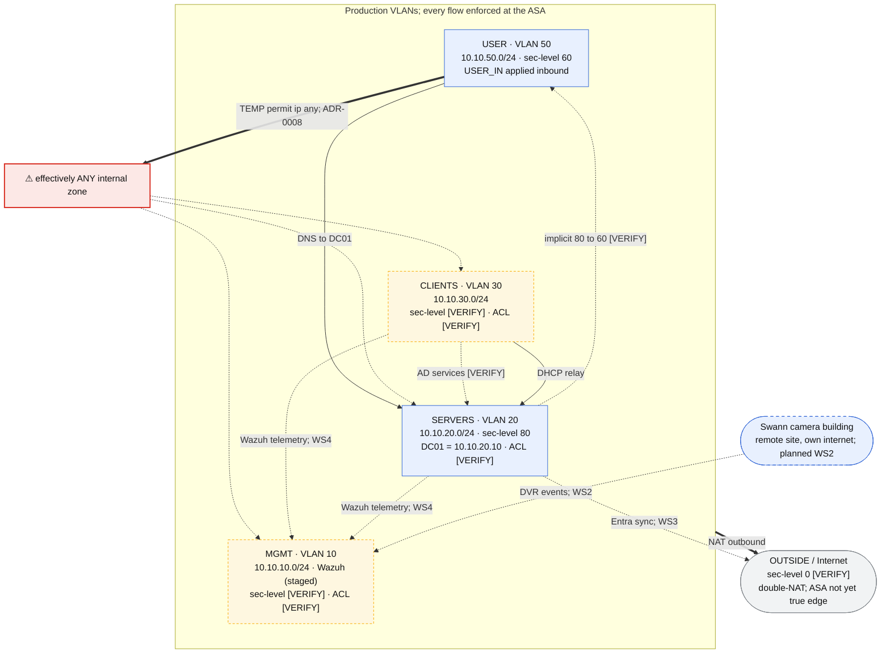

# Trust & ACL Flow (Logical Policy View)

**Last updated:** 2026-07-03

Companion to [`network-topology.md`](network-topology.md). That diagram shows what is *connected* (devices, ports, trunks). This one shows what is *permitted* and where it is enforced: the logical trust boundaries between segments, current state plus the planned flows that will cross them.

This document has three layers with distinct jobs: the **graph** is the narrative overview, the **reachability matrix** is the authoritative statement of current policy state (every zone pair accounted for, including the unknowns), and the **flows table** is the evidence layer recording the basis for each entry.

All inter-VLAN traffic is enforced at one point: the **Cisco ASA 5506-X**, router-on-a-stick over the 802.1Q trunk to the SG350 (the switch does L2 tagging only). The steady-state target is **default-deny between segments with explicit least-privilege permits** (ADR-0003). One temporary exception is in effect (ADR-0008). Anything marked **[VERIFY]** is not yet reconciled against the running config; it mirrors the open items in [`../artifacts/asa-acl-ruleset.md`](../artifacts/asa-acl-ruleset.md), and all of it is cleared by one run of the [WS1 verification runbook](../../SOPs/ws1-verification-runbook.md) (Phases 1 and 2).

Edge labels are deliberately terse; the Flows table below carries the full rule text, basis, and status for every edge.

**Legend.** Blue box = zone with known parameters. Amber dashed box = zone whose security level / ACL state is unverified. Red box = effective over-reach (documented technical debt). Gray box = external. Blue dashed box = planned, not built. Solid arrow = explicit documented permit or built behavior; thick arrow = temporary permit (debt) or NAT; dotted arrow = implicit/by-default, unverified, or planned flow (planned edges are labeled as such).

## Reachability Matrix (Current State)

Source zone (rows) to destination zone (columns), as enforced at the ASA today. Unlike the graph, every pair must declare itself; an unknown here is a visible gap, not a missing arrow. Planned flows are deliberately absent; the matrix records state, not commitments.

| Source ↓ Dest → | USER | CLIENTS | SERVERS | MGMT | OUTSIDE |
|---|---|---|---|---|---|
| **USER** (60, `USER_IN`) | n/a | Permit; **temp** (ADR-0008) | Permit; **temp** (DNS permit permanent) | Permit; **temp** (ADR-0008) | Permit; NAT outbound |
| **CLIENTS** (level **[VERIFY]**) | Unknown **[VERIFY]** | n/a | Functions (AD services, DHCP relay); mechanism **[VERIFY]** | Unknown **[VERIFY]** | Permit; NAT outbound |
| **SERVERS** (80) | Implicit permit, 80 to 60 **[VERIFY]** | Depends on CLIENTS level **[VERIFY]** | n/a | Depends on MGMT level **[VERIFY]** | Permit; NAT outbound |
| **MGMT** (level **[VERIFY]**) | Unknown **[VERIFY]** | Unknown **[VERIFY]** | Unknown **[VERIFY]** | n/a | Permit; NAT outbound |
| **OUTSIDE** (0 **[VERIFY]**) | No path | No path | No path | No path | n/a |

Reading notes:

- **n/a** = intra-zone traffic never crosses the ASA (switch does L2 only), so no policy applies here.
- **The USER row is ADR-0008 made visible.** After the re-restriction at end of WS1, every USER cell reverts to implicit deny except explicitly scoped permits.
- **The OUTSIDE row** relies on the double-NAT upstream and the absence of static NAT entries; confirm no statics exist during verification (Phase 1.6).
- **Steady-state target:** when verification completes, every Unknown cell must resolve to either a documented permit with a basis or a deny. An Unknown that survives verification is a finding.
- Every **[VERIFY]** cell resolves in Phases 1 and 2 of the WS1 verification runbook; update this matrix, the graph, and `asa-acl-ruleset.md` together.

## Flows shown

| Flow | Basis | Type | Status |
|---|---|---|---|
| USER → SERVERS (DC01:53) | `USER_IN` permit udp/tcp 53 to 10.10.20.10 | Explicit permit | Permanent |
| USER → ANY internal | `USER_IN` permit ip 10.10.50.0/24 any | Explicit permit | **Temporary**: ADR-0008, remove end of WS1 |
| CLIENTS → SERVERS (DC01: AD services) | Domain joins, authentication, and GPO pulls succeed (2026-06-04/08/12 journals), so the path demonstrably functions | Functioning; mechanism unrecorded | **[VERIFY]**: either CLIENTS sec-level > 80 or an unrecorded ACL permits it |
| CLIENTS → DC01 (DHCP) | ASA `dhcprelay` forwards CLIENTS broadcasts to 10.10.20.10 (2026-05-10 journal) | To-the-box relay, not an ACL flow | Built |
| SERVERS → USER | Implicit security-level (80 → 60) | Default-permit | **[VERIFY]**: no SERVERS ACL recorded |
| All VLANs → Internet | NAT (no inbound; double-NAT) | NAT outbound | Built; ASA not yet true edge |
| MGMT / CLIENTS inter-zone | Security levels & ACLs not recorded | Unknown | **[VERIFY]** |
| SERVERS → Internet (Entra sync) | Entra Connect Sync outbound from SRV01, member server not DC | Planned | WS3 |
| CLIENTS / SERVERS → MGMT (telemetry) | Wazuh agents to SIEM on MGMT | Planned | WS4; Wazuh hardware staged, not deployed |
| Swann building → MGMT (telemetry) | Micro #2 ships DVR events to Wazuh, encrypted, over the building's own internet | Planned | WS2; requires the ASA to become the true edge first |

## Notes

- **Single choke point.** The ASA is the only inter-VLAN enforcement point; the SG350 does L2 tagging only. Every edge above is policy applied at the ASA.
- **The temporary permit dominates.** While `permit ip 10.10.50.0/24 any` is in place (ADR-0008), the USER VLAN can reach every internal zone, which makes the scoped DNS permit above effectively moot. Removal trigger: end of Workstream 1, or sooner if the ASA becomes the true edge.
- **CLIENTS → SERVERS is drawn as functioning-but-unverified.** The business workstations reach DC01 today (joins, Kerberos, GPO), so the reachability is real; what is unknown is the mechanism (CLIENTS security level above 80, or an unrecorded ACL). Omitting the edge would misstate reality worse than drawing it dotted.
- **DHCP relay is a to-the-box flow.** The ASA relays CLIENTS DHCP broadcasts to DC01 via `dhcprelay` (2026-05-10 journal). It is configuration on the ASA itself, not an interface ACL entry, so it will not appear in `show running-config access-group` during verification; check `show running-config dhcprelay` instead.
- **ICMP is denied through the ASA** by design (2026-05-06 journal); outbound web works while ping fails. Not drawn as a flow because nothing is permitted.
- **Planned flows are commitments, not state.** The three planned edges (Entra sync, Wazuh telemetry, Swann integration) describe where trust boundaries will be crossed by later workstreams. Each will require explicit permits consistent with default-deny when built; none exist in the running config today.
- **Open verification items.** MGMT and CLIENTS security levels, whether ACLs exist on MGMT / SERVERS / CLIENTS, and the mechanism behind CLIENTS → SERVERS are unconfirmed. The [WS1 verification runbook](../../SOPs/ws1-verification-runbook.md) is the procedure that resolves all of them (Phases 1 and 2); after the run, update this diagram, the matrix, and `asa-acl-ruleset.md` in the same commit.
- **Source of truth** is the running config; this diagram explains intent and current state, not the authoritative ruleset.
